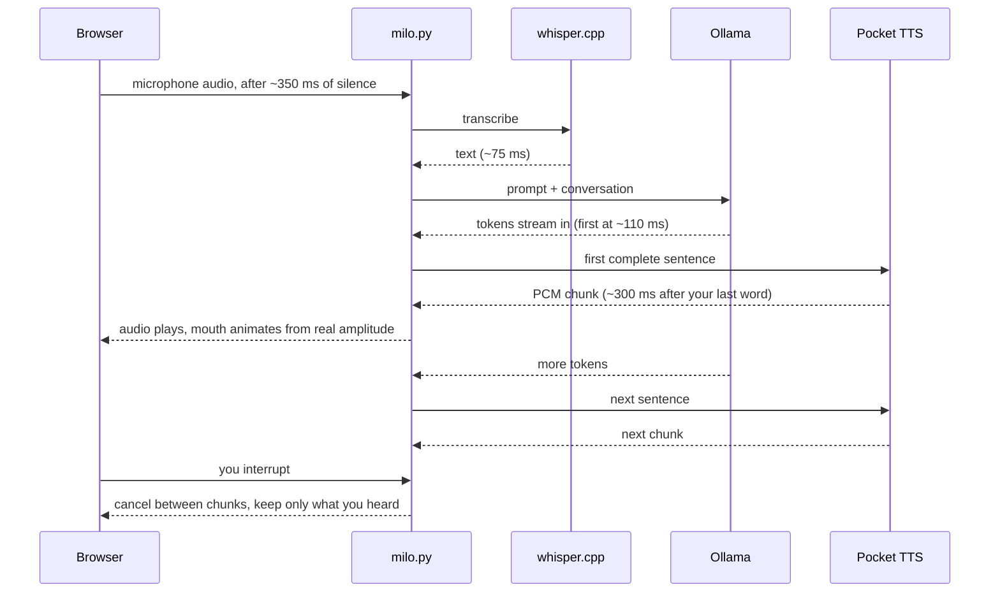

<p align="center">
  
</p>

# Milo

A voice companion that runs entirely on your computer. You talk, it talks back, and you can
cut in while it is speaking. Transcription, the language model and the voice all run locally.
The internet is used only when you say "look up ...", and then only your search query leaves.

The hard part of a local voice assistant is the gap after you stop talking. On a
machine where the model fits in VRAM, Milo starts speaking about 300 ms after a typed turn
and about 400 ms after a spoken one. `docs/latency.md` lists the measurements and what each
change was worth.

## Set it up with an agent

Clone the repo, open it in Claude Code or any coding agent that reads `CLAUDE.md`, and say:

> Set up Milo on this machine.

The agent runs the doctor, installs what is missing, picks a model that fits your GPU, caches
the voices, and proves one spoken turn works before handing you the URL.

Arch-based Linux is where Milo runs today. Windows 11 is documented command by command in
`docs/setup.md` and is not yet proven on someone else's machine, which is the top item in
`docs/roadmap.md`.

## Set it up by hand

`docs/setup.md` has the commands per OS. The short version:

1. Python 3.11 to 3.13 in `.venv`, CPU torch, then `requirements.txt`.
2. Ollama with a model pulled (`docs/models.md` says which one for your VRAM).
3. A whisper.cpp server on port 8178 with a ggml model.
4. `cp milo.config.example.json milo.config.json`, set your model and name.
5. `python milo.py setup-voices`, then `python milo.py doctor` until it prints `READY`.
6. `python milo.py` and open http://127.0.0.1:8766.

## How a turn works



It feels quick for three reasons. The reply is split into sentences as tokens arrive, so each
sentence is spoken while the model writes the next one. The doctor picks a model that fits in
VRAM beside Whisper, because a model spilling into system RAM takes three to five times longer
to the first word. And Pocket TTS runs on two CPU threads, so the GPU stays free for the model.


## What you get

You can talk over Milo or press Escape. The turn is cancelled between audio chunks, and only
the sentences you actually heard stay in the conversation, so it never refers back to
something it was cut off before saying. Nothing is written to disk: no transcripts, no audio.
The conversation lives in the browser tab and is gone when you close it.

The robot is plain SVG and CSS in `web/`, in two builds, with expressions tied to state
(idle, listening, thinking, speaking) and a mouth driven by the amplitude of whatever is
currently playing. Settings holds five Pocket TTS voices to audition and a "small speaker"
filter that makes any of them sound like it comes out of the robot rather than a narrator.
Finding a voice that actually reads as a small robot is still open work.

Saying "look up ..." sends that query, and only that query, to DuckDuckGo or Brave without an
API key. Milo answers from the snippets, shows you the sources, and treats the text it got
back as quoted material rather than as instructions.

## Which model

`python milo.py doctor` reads your VRAM and suggests a tier (`docs/models.md` has the bake-off):

| Card | Tag |
|---|---|
| 12 GB and up | `gemma4:12b` |
| 16 GB, patient | `gpt-oss:20b` (reasons first, slower first word) |
| 6 to 8 GB | `gemma4:4b` |
| CPU only, 16 GB RAM | `gemma4:4b` or `qwen2.5:3b` |

CPU-only works. It just thinks for longer before it speaks.

## Commands

```
python milo.py                 start (port and model from milo.config.json)
python milo.py doctor          what is installed, what is reachable, what fits this machine
python milo.py setup-voices    one-time voice cache
python milo.py test            unit tests
python milo.py probe           latency probe against a test server
```

## Privacy

The server listens on 127.0.0.1 only. Audio goes to the whisper.cpp server on this machine
and nowhere else. No telemetry, no update check, no crash reporting. The only outbound traffic
is the one-time voice download during `setup-voices`, the Ollama model pull, and your search
query when you ask for a lookup.

Milo has no desktop actions, files, shell, calendar, or memory between sessions, and makes no
paid API calls. The system prompt tells the model so, and it never pretends otherwise.

## License

MIT. Pocket TTS, whisper.cpp and Ollama carry their own licenses, and the voice presets come
with their own terms; `docs/voices-and-upstream.md` has the upstream sources.
