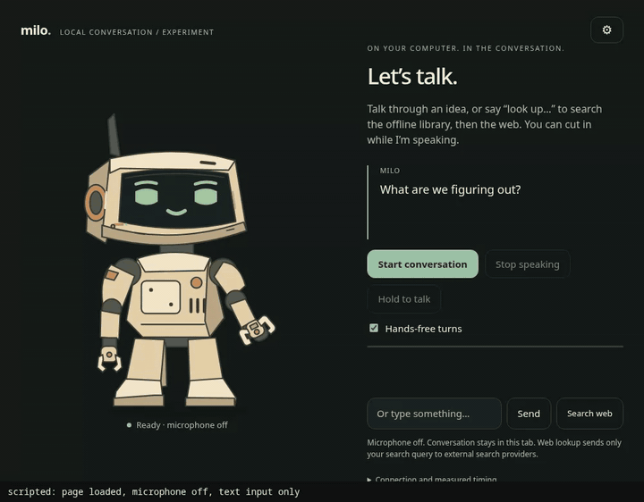
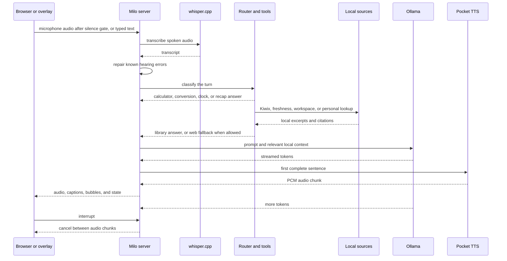

<p align="center">
  
</p>

# Milo

[](https://github.com/Calculator5329/milo/actions/workflows/tests.yml)

A local voice companion that listens while you talk, answers with a local
language model, and speaks back through a small robot. Whisper, Ollama, and
Pocket TTS run on the same computer by default. The router uses deterministic
tools and local sources before it asks the model to answer.

Linux is the proven platform. Windows 11 is documented command by command in
`docs/setup.md`, but still needs a stranger setup to move from documented to
proven. The corner overlay is Wayland-only.

## Measured latency

Milo has no wake word. A spoken turn starts when the page sends your sentence,
350 ms after you stop talking, so add that gate to the numbers below. Each cell
is the p50 of four synthetic spoken turns on an RTX 5070 Ti 16 GB with
`gemma4:12b`, whisper.cpp `large-v3-turbo`, and Pocket TTS on the CPU.

| Stage | 2026-09-12, idle machine | 2026-09-24, busy machine |
|---|---|---|
| Sentence sent to first model token, transcription included | 186 ms | 670 ms |
| First model token to first audio at the client | 219 ms | 186 ms |
| Sentence sent to first audio at the client | 404 ms | 850 ms |
| Stop pressed to server turn stream closed | not measured | 14.5 ms (max 80 ms) |

The second reading was taken while other jobs held the machine at a load
average of 38, so it is the worse case, not the typical one. In the six
interrupted turns, no audio chunk arrived after the cancel, and the page stops
its own playback at the click. Sources:
`docs/evidence/latency-20260912-rtx5070ti-gemma4-12b.json`,
`docs/evidence/latency-20260924-rtx5070ti-gemma4-12b-busy.json`,
`docs/evidence/interrupt-20260924-rtx5070ti-gemma4-12b.json`. The first-token
to first-audio row is the p50 of each turn's own difference. `docs/latency.md`
explains how each number moved and how to measure your machine.



A real turn on the page, driven by Playwright with no microphone and no sound.
The script types a request for a long story, presses Stop while Milo is
speaking, then asks what he last said. He answers with the one sentence that played before the
Stop, because unplayed sentences never enter the history. The strip along the
bottom is the script's label, not part of Milo. Video:
[`docs/interrupt-demo.mp4`](docs/interrupt-demo.mp4).

## Set it up with an agent

Clone the repo, open it in an agent that reads `CLAUDE.md`, and say:

> Set up Milo on this machine.

The agent runs the doctor, installs what is missing, chooses a model tier,
caches the voices, and proves the pipeline before handing over the local URL.

## Set it up by hand

`docs/setup.md` has the commands for Windows 11 and Arch-based Linux. The short
version is:

1. Create `.venv` with Python 3.11 to 3.13, install CPU torch, then
   `requirements.txt`.
2. Install Ollama and pull one model.
3. Run whisper.cpp on port 8178 with a ggml model.
4. Copy `milo.config.example.json` to `milo.config.json` and set the model and
   optional paths.
5. Run `python milo.py setup-voices`, then `python milo.py doctor` until it
   prints `READY`.
6. Run `python milo.py` and open http://127.0.0.1:8766.

## How a turn works



Tools run before model generation. Arithmetic, unit conversion, clock answers,
and recaps do not call the model. Factual questions can use the offline Kiwix
library, and the title probe is bounded so a slow book does not hold up a turn.
The freshness index handles questions like “what's in the news”. Workspace and
personal books are opt-in. Follow-up questions carry the previous subject when
the wording uses “he”, “it”, “there”, or “and what about”.

## What you get

- Calculator, unit conversion, clock, and spelling tools before the model.
- Transient reminders through Linux systemd user timers.
- An optional offline library with local citations and Wiktionary definitions.
- A rolling news index from the bundled RSS and Hacker News feeds.
- Follow-ups, recap, command bubbles, link bubbles, and hearing repairs.
- An optional Wayland corner overlay and Hyprland hold-to-talk hotkey.
- An optional OpenAI-compatible cloud model for explicit careful turns.
- A 214-question evaluation bank and nightly replay artifacts.

Milo can be interrupted between audio chunks. Only the sentences you heard stay
in the session history, so an interrupted answer does not become false context.
Commands, links, and exact text appear in a bubble beside the robot. Speech
refers to them as “the command above me” rather than pretending it executed
anything.

## Commands

```text
python milo.py                 start the local server
python milo.py doctor          check dependencies and readiness
python milo.py setup-voices    cache the Pocket TTS voices
python milo.py test            run unit tests
python milo.py probe           measure a running server
python milo.py freshness       ingest the optional news index
python milo.py health          serve the local health page
python milo.py bank --label x  run the evaluation bank
python scripts/interrupt_probe.py  measure how fast Stop ends a turn
```

## Privacy

The server listens on loopback. Audio goes to the local whisper.cpp server, the
local model runs through Ollama, and the voice is generated locally. The
conversation and turn log stay on this computer unless the configured web or
cloud feature is used.

The offline library, workspace book, personal book, remembered notes, reminders,
and evaluation artifacts are local. News ingestion fetches the configured feeds
when you run it and keeps the result in local SQLite. A web search sends a query
only when you ask Milo to look something up or request a live fact such as
weather or a price. The optional cloud model sends only the current question,
not conversation history, documents, search snippets, or audio.

There is no telemetry, update check, or crash reporting. Voice setup and model
pulls are the expected one-time downloads. Empty `kiwix_url`, `workspace_root`,
and `personal_book` keep those optional sources off.

## How it was built

Agents wrote most of the code. I directed it: 12 of the 15 commits before this
section carry a Claude co-author line. What I decided:

- Milo runs on one computer. Audio, the model and the voice stay local, and the
  web is used only when you ask for a lookup.
- Speech synthesis runs on the CPU so the GPU stays free for the model.
- A stranger should be able to clone the repo, open it in an agent, and say
  "set up Milo". `CLAUDE.md` is that setup contract.
- The default model came from a bake-off on the real pipeline, not from a
  benchmark. `docs/models.md` has the results.
- An interrupted answer must not become false context, so only sentences that
  finished playing enter the history.
- The README says only what is proven. Windows is documented, not proven, until
  someone else sets it up.

What checked the work:

- `python milo.py test`: the unit suite, stdlib only. `.github/workflows/tests.yml`
  runs it on every push when Actions are enabled on the repo.
- `python milo.py doctor`: prints `READY` only when every required piece is
  present.
- `python milo.py probe` and `scripts/interrupt_probe.py`: stage timings saved
  as JSON, with reference readings in `docs/evidence/`.
- `python milo.py bank`: a 214-question evaluation bank with nightly replay.
- Playwright checks in `milo/demo/verify_*.cjs` for the page, the overlay and
  playback.

## License

MIT. Pocket TTS, whisper.cpp, and Ollama carry their own licenses. The upstream
sources and voice terms are listed in `docs/voices-and-upstream.md`.
