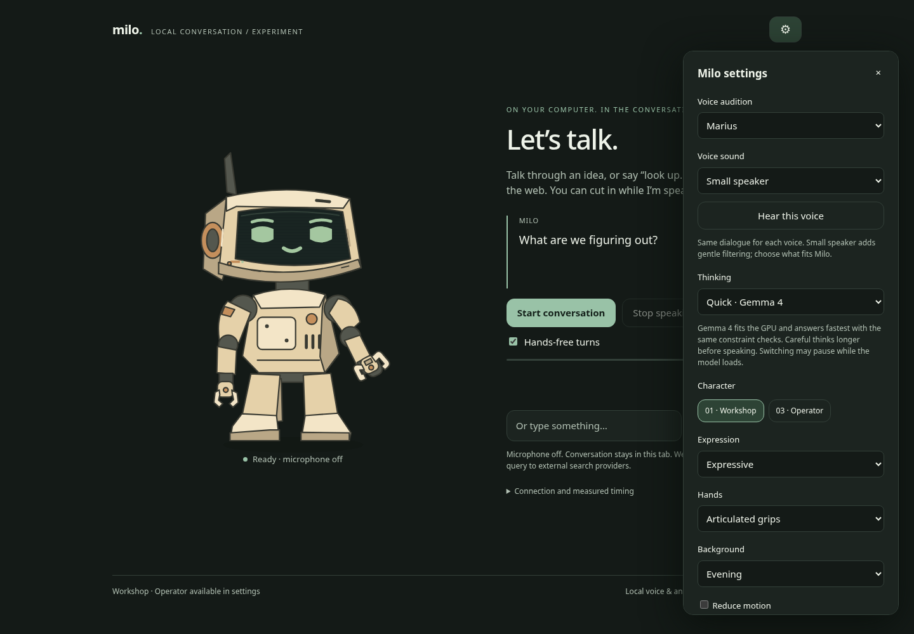

# Milo

A local voice companion that runs entirely on your computer. You talk, it talks back, and
you can cut in while it is speaking. Transcription, the language model and the voice all
run on your machine; the internet is used only when you say "look up ..." and then only
your search query leaves.


Speech starts about 300 to 400 ms after you finish talking on a machine with a mid-range
GPU. `docs/latency.md` shows the measurements and each change that got there.

## Set it up with an agent

Clone the repo and open it in Claude Code (or any coding agent that reads `CLAUDE.md` or
`AGENTS.md`), then say:

> Set up Milo on this machine.

The agent runs the doctor, installs what is missing for your OS, picks a model that fits
your GPU, asks what Milo should call you, caches the voices, and proves one spoken turn
works before handing you the URL. Windows 11 and Arch-based Linux (CachyOS) are the tested
targets; other Linux distributions differ only in the package manager commands.

## Set it up by hand

`docs/setup.md` has the commands. The short version:

1. Python 3.11 to 3.13 in `.venv`, CPU torch, then `requirements.txt`.
2. Ollama with a model pulled (`docs/models.md` says which one for your VRAM).
3. A whisper.cpp server on port 8178 with a ggml model.
4. `cp milo.config.example.json milo.config.json`, set your model and name.
5. `python milo.py setup-voices`, then `python milo.py doctor` until it prints `READY`.
6. `python milo.py` and open http://127.0.0.1:8766.

## How a turn works

```mermaid
sequenceDiagram
    participant B as Browser
    participant S as milo.py server
    participant W as whisper.cpp
    participant O as Ollama
    participant T as Pocket TTS

    B->>S: microphone audio (after ~350 ms of silence)
    S->>W: transcribe
    W-->>S: text (~75 ms)
    S->>O: prompt + conversation
    O-->>S: tokens stream in (first at ~110 ms)
    S->>T: first complete sentence
    T-->>S: PCM chunk (~300 ms after your last word)
    S-->>B: audio starts playing, mouth animates from real amplitude
    O-->>S: more tokens
    S->>T: next sentence
    T-->>S: next chunk
    B->>S: you interrupt
    S-->>B: cancel between chunks; only what you heard is kept
```

Three things make it feel quick:

- **Sentence streaming.** The reply is split into sentences as tokens arrive, and each
  sentence goes to the voice while the model is still writing the next one. What you feel is
  time to the first sentence, not time to the whole answer.
- **Everything resident.** A model that fits in VRAM beside Whisper answers in about a
  tenth of a second. The doctor measures your VRAM and picks a tier that fits, because a model
  spilling a few layers into system RAM takes three to five times longer before the first word.
- **Voice on the CPU.** Pocket TTS runs on two CPU threads, so the GPU stays free for the
  language model. That is why the setup installs CPU torch on purpose.

## What it is

- **Local pipeline.** Browser microphone to a whisper.cpp server, text to Ollama, sentences
  streamed into Pocket TTS on the CPU while the model is still generating, PCM back to the
  browser. One Python process, standard library plus torch and pocket-tts.
- **Interruptible.** Speak over it or press Escape. The server cancels the turn between
  audio chunks; only sentences you actually heard stay in the conversation history.
- **The rig.** An SVG robot with expressions tied to state (idle, listening, thinking,
  speaking) and a mouth driven by real playback amplitude. Two looks, Workshop and Operator,
  with options for hands, expression, and motion. The rig is plain SVG and CSS in
  `web/index.html` and `web/app.js`; restyle it freely.
- **Voices.** Five Pocket TTS presets you can audition in Settings with identical dialogue,
  plus a "small speaker" filter that makes any of them sound like it comes from the robot.
- **Web lookup on request.** "Look up ..." or the Search web button sends the query to
  DuckDuckGo or Brave through `ddgs`, no API key. Milo answers from the snippets, shows the
  sources, and treats the excerpts as untrusted quoted text, never as instructions. Result
  pages are never fetched.
- **Nothing kept.** No transcripts or audio on disk; the conversation lives in the tab.
  Preferences (voice, model, silence gate) persist in the browser's local storage.



## Which model

`python milo.py doctor` reads your VRAM and RAM and suggests a tier. The defaults, from a
bake-off through Milo's own prompt on 2026-09-12 (`docs/models.md` has the full table and
how it was run):

| Card | Tag | Why |
|---|---|---|
| 12 GB and up | `gemma4:12b` | Correct on the constraint prompts with no thinking pass; 118 ms p50 first token on a 16 GB card. |
| 16 GB, patient | `gpt-oss:20b` | Reasons before answering. Slower first word, best on tricky questions. |
| 6 to 8 GB | `gemma4:4b` | Fits beside Whisper with room to spare. |
| CPU only, 16 GB RAM | `gemma4:4b` or `qwen2.5:3b` | Works; expect a few seconds of thinking. |

## What it is not

No desktop actions, files, shell, calendar, or memory between sessions, and no paid API
calls. Those are plug-in points for later. The system prompt tells the model it has none of
them so it never pretends to.

## Commands

```
python milo.py                 start (port and model from milo.config.json)
python milo.py doctor          what is installed, what is reachable, what fits this machine
python milo.py setup-voices    one-time voice cache
python milo.py test            unit tests
python milo.py probe           latency probe against a test server
```

## Layout

```
milo.py                    launcher; re-executes itself inside .venv
milo/server.py             the pipeline: validation, transcription, streaming, cancellation
milo/web_search.py         explicit lookups, public-URL filtering, snippet cleaning
milo/config.py             defaults, milo.config.json, MILO_* overrides
web/                       the page, the rig, the audio worklet
scripts/doctor.py          the checklist an agent or a person runs
scripts/setup_voices.py    caches Pocket TTS and the voice states
tests/                     unit tests and the latency probe
docs/                      setup, models, latency, voices, evidence
```

## Privacy, stated plainly

- The server listens on 127.0.0.1. Nothing is exposed to the network.
- Audio goes from your browser to the whisper.cpp server on this machine and nowhere else.
- No telemetry, no update check, no crash reporting.
- The only outbound traffic is the one-time voice download from Hugging Face during
  `setup-voices`, the Ollama model pull, and the search query when you ask for a lookup.

## License

MIT. Pocket TTS weights are CC-BY-4.0 from Kyutai; whisper.cpp and Ollama carry their own
licenses; see `docs/voices-and-upstream.md`.
