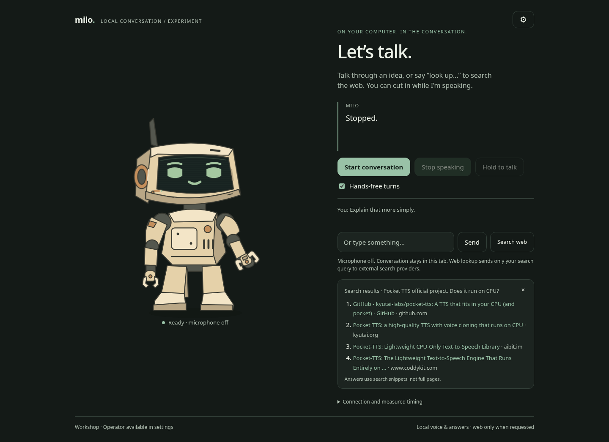

# Milo

A local voice companion that runs entirely on your computer. You talk, it talks back, and
you can cut in while it is speaking. Transcription, the language model, and the voice all
run on your machine; the internet is used only when you say "look up ..." and then only
your search query leaves.



Speech starts about 300 to 400 ms after you finish talking on a machine with a mid-range
GPU. `docs/latency.md` shows the measurements and each change that got there.

## Set it up with an agent

Clone the repo and open it in Claude Code (or any coding agent that reads `CLAUDE.md` or
`AGENTS.md`), then say:

> Set up Milo on this machine.

The agent runs the doctor, installs what is missing for your OS, picks a model that fits
your GPU, asks what Milo should call you, caches the voices, and proves one spoken turn
works before handing you the URL. Windows 11 and Arch-based Linux (CachyOS) are the tested
targets; other Linux distributions differ only in the package manager commands.

## Set it up by hand

`docs/setup.md` has the commands. The short version:

1. Python 3.11 to 3.13 in `.venv`, CPU torch, then `requirements.txt`.
2. Ollama with a model pulled (`docs/models.md` says which one for your VRAM).
3. A whisper.cpp server on port 8178 with a ggml model.
4. `cp milo.config.example.json milo.config.json`, set your model and name.
5. `python milo.py setup-voices`, then `python milo.py doctor` until it prints `READY`.
6. `python milo.py` and open http://127.0.0.1:8766.

## What it is

- **Local pipeline.** Browser microphone to a whisper.cpp server, text to Ollama, sentences
  streamed into Pocket TTS on the CPU while the model is still generating, PCM back to the
  browser. One Python process, standard library plus torch and pocket-tts.
- **Interruptible.** Speak over it or press Escape. The server cancels the turn between
  audio chunks; only sentences you actually heard stay in the conversation history.
- **The rig.** An SVG robot with expressions tied to state (idle, listening, thinking,
  speaking) and a mouth driven by real playback amplitude. Two looks, Workshop and Operator,
  and options for hands and motion, all in Settings. The rig is plain SVG and CSS in
  `web/index.html` and `web/app.js`; restyle it freely.
- **Voices.** Five Pocket TTS presets you can audition in Settings with identical dialogue.
- **Web lookup on request.** "Look up ..." or the Search web button sends the query to
  DuckDuckGo or Brave through `ddgs`, no API key. Milo answers from the snippets, shows the
  sources, and treats the excerpts as untrusted quoted text, never as instructions. Result
  pages are never fetched.
- **Nothing kept.** No transcripts or audio on disk; the conversation lives in the tab.
  Preferences (voice, model, silence gate) persist in the browser's local storage.

## What it is not

No desktop actions, files, shell, calendar, or memory between sessions, and no paid API
calls. Those are plug-in points for later. The system prompt tells the model it has none of
them so it never pretends to.

## Commands

```
python milo.py                 start (port and model from milo.config.json)
python milo.py doctor          what is installed, what is reachable, what fits this machine
python milo.py setup-voices    one-time voice cache
python milo.py test            unit tests
python milo.py probe           latency probe against a test server
```

## Layout

```
milo.py                    launcher; re-executes itself inside .venv
milo/server.py             the pipeline: validation, transcription, streaming, cancellation
milo/web_search.py         explicit lookups, public-URL filtering, snippet cleaning
milo/config.py             defaults, milo.config.json, MILO_* overrides
web/                       the page, the rig, the audio worklet
scripts/doctor.py          the checklist an agent or a person runs
scripts/setup_voices.py    caches Pocket TTS and the voice states
tests/                     unit tests and the latency probe
docs/                      setup, models, latency, voices, evidence
```

## License

MIT. Pocket TTS weights are CC-BY-4.0 from Kyutai; whisper.cpp and Ollama carry their own
licenses; see `docs/voices-and-upstream.md`.
